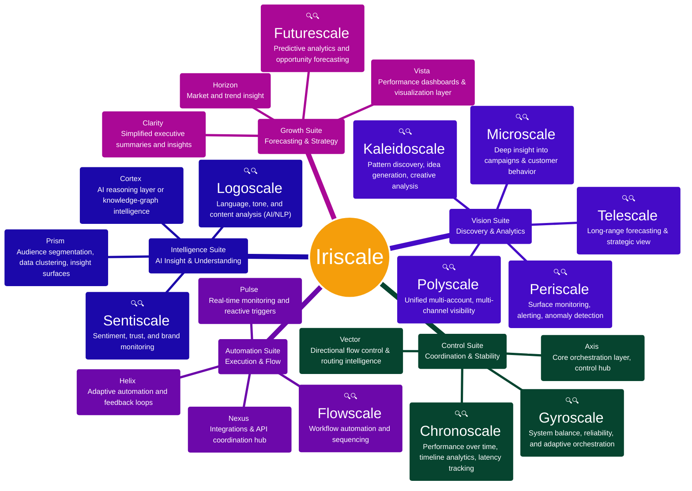
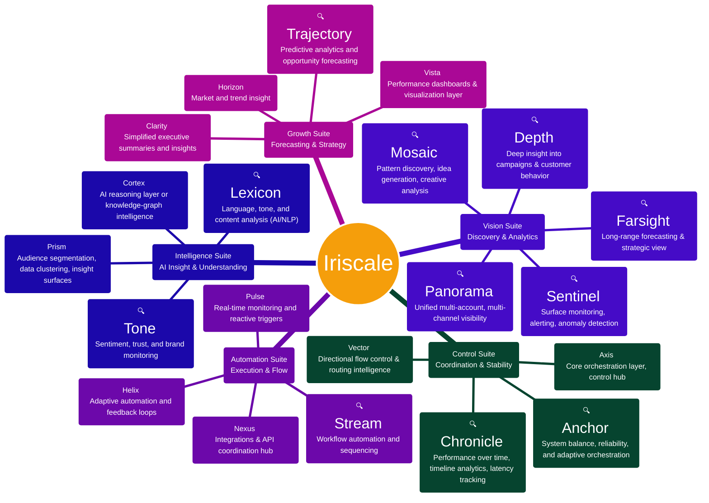
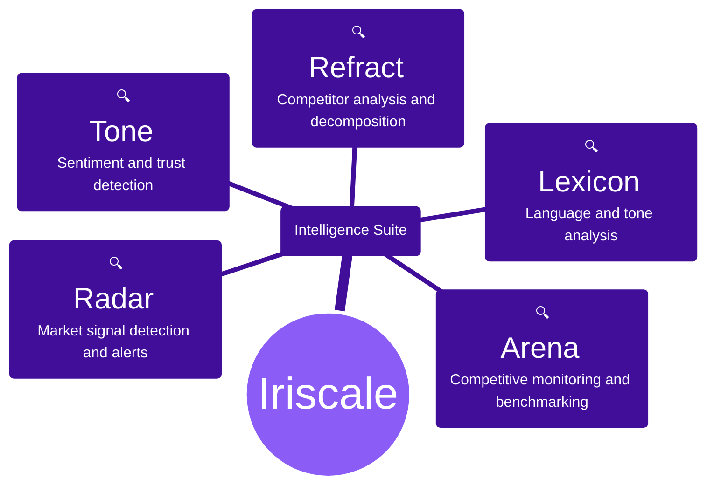
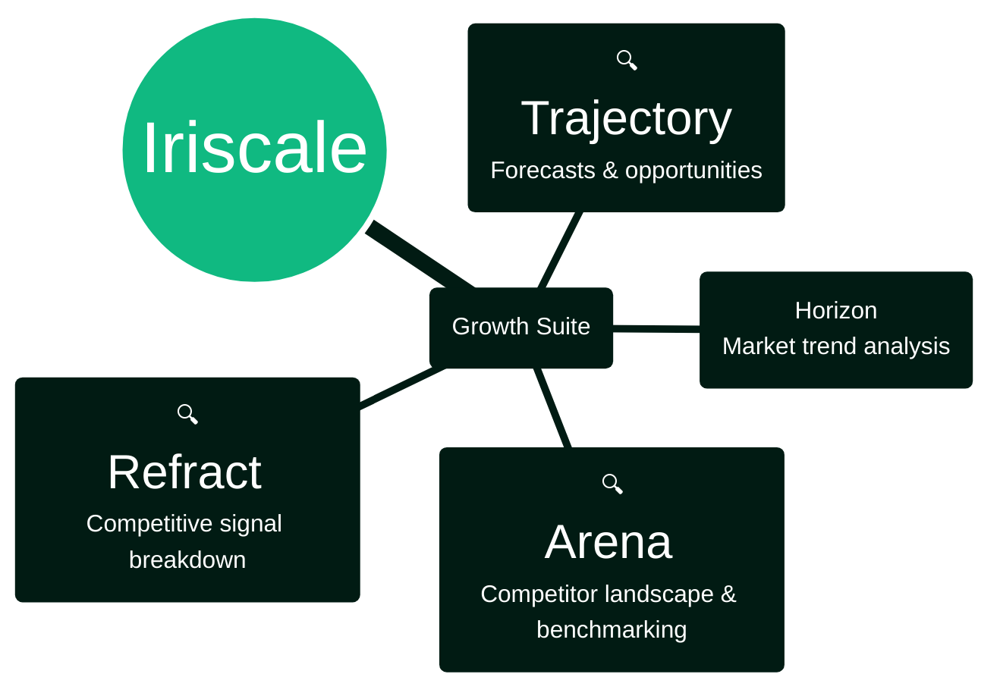

---

## Intelligence Suite Focus

---

## Growth Suite Focus

---

## Alternate Product Names (Semantic)

| Current (-scale) | Alternate | Function |
|------------------|-----------|----------|
| Telescale | **Farsight** | Long-range forecasting & strategic view |
| Microscale | **Depth** | Deep insight into campaigns & customer behavior |
| Kaleidoscale | **Mosaic** | Pattern discovery, idea generation, creative analysis |
| Polyscale | **Panorama** | Unified multi-account, multi-channel visibility |
| Periscale | **Sentinel** | Surface monitoring, alerting, anomaly detection |
| Gyroscale | **Anchor** | System balance, reliability, and adaptive orchestration |
| Chronoscale | **Chronicle** | Performance over time, timeline analytics, latency tracking |
| Logoscale | **Lexicon** | Language, tone, and content analysis (AI/NLP) |
| Sentiscale | **Tone** | Sentiment, trust, and brand monitoring |
| Flowscale | **Stream** | Workflow automation and sequencing |
| Futurescale | **Trajectory** | Predictive analytics and opportunity forecasting |
| Spectroscale | **Refract** | Competitor analysis and decomposition |
| Rivalscale | **Arena** | Competitive monitoring and benchmarking |
| Signalscale | **Radar** | Market signal detection and alerts |

---

## Alternate Mindmap (Semantic Names)

---

## Alternate Intelligence Suite Focus

---

## Alternate Growth Suite Focus

