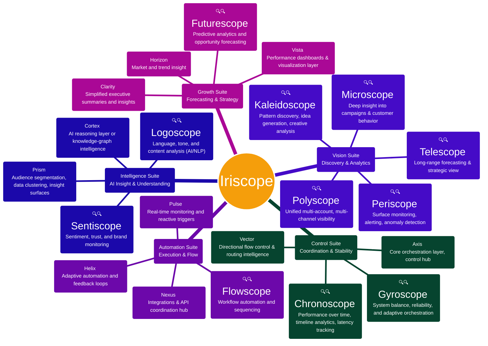
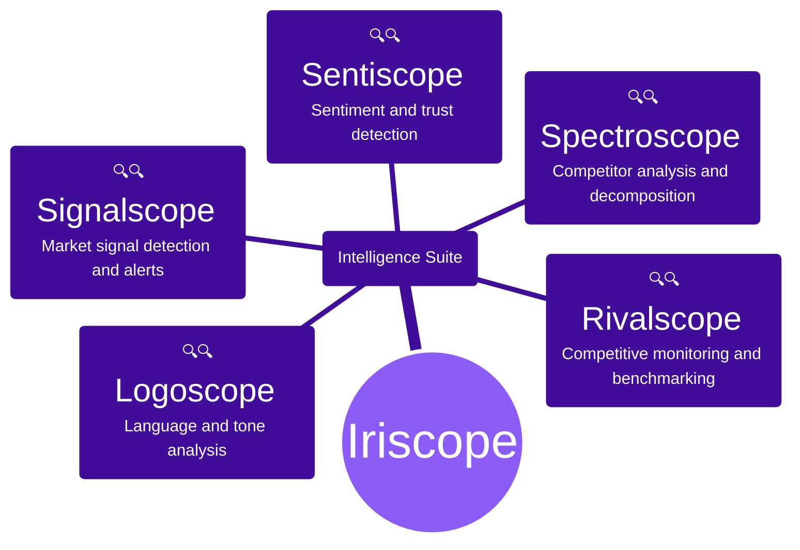
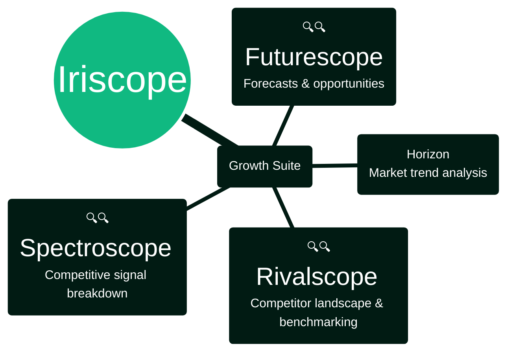

```mermaid
%%{init: {'theme':'base', 'themeVariables': { 'primaryColor':'#3b82f6','primaryTextColor':'#fff','primaryBorderColor':'#fff','lineColor':'#fff','secondaryColor':'#8b5cf6','tertiaryColor':'#10b981','noteBkgColor':'#1e293b','noteTextColor':'#fff'}, 'themeCSS': '.mindmap-node.section-root { font-size: 48px !important; } .mindmap-node.section-root circle { fill: #f59e0b !important; stroke: #ffffff !important; stroke-width: 4px !important; r: 90px !important; } .mindmap-node.depth-2 rect, .mindmap-node.depth-2 circle { stroke: #fbbf24 !important; stroke-width: 3px !important; stroke-dasharray: 5,5 !important; }'}}%%
mindmap
  root(("Iriscope"))
    ("Vision Suite <br/>Discovery & Analytics")
      ("🔍🔍<br/><span style='font-size:2em'>Telescope</span> <br/>Long-range forecasting & strategic view")
      ("🔍🔍<br/><span style='font-size:2em'>Microscope</span> <br/>Deep insight into campaigns & customer behavior")
      ("🔍🔍<br/><span style='font-size:2em'>Kaleidoscope</span> <br/>Pattern discovery, idea generation, creative analysis")
      ("🔍🔍<br/><span style='font-size:2em'>Polyscope</span> <br/>Unified multi-account, multi-channel visibility")
      ("🔍🔍<br/><span style='font-size:2em'>Periscope</span> <br/>Surface monitoring, alerting, anomaly detection")
    ("Control Suite <br/>Coordination & Stability")
      ("🔍🔍<br/><span style='font-size:2em'>Gyroscope</span> <br/>System balance, reliability, and adaptive orchestration")
      ("🔍🔍<br/><span style='font-size:2em'>Chronoscope</span> <br/>Performance over time, timeline analytics, latency tracking")
      ("Axis <br/>Core orchestration layer, control hub")
      ("Vector <br/>Directional flow control & routing intelligence")
    ("Intelligence Suite <br/>AI Insight & Understanding")
      ("🔍🔍<br/><span style='font-size:2em'>Logoscope</span> <br/>Language, tone, and content analysis (AI/NLP)")
      ("🔍🔍<br/><span style='font-size:2em'>Sentiscope</span> <br/>Sentiment, trust, and brand monitoring")
      ("Prism <br/>Audience segmentation, data clustering, insight surfaces")
      ("Cortex <br/>AI reasoning layer or knowledge-graph intelligence")
    ("Automation Suite <br/>Execution & Flow")
      ("🔍🔍<br/><span style='font-size:2em'>Flowscope</span> <br/>Workflow automation and sequencing")
      ("Pulse <br/>Real-time monitoring and reactive triggers")
      ("Helix <br/>Adaptive automation and feedback loops")
      ("Nexus <br/>Integrations & API coordination hub")
    ("Growth Suite <br/>Forecasting & Strategy")
      ("🔍🔍<br/><span style='font-size:2em'>Futurescope</span> <br/>Predictive analytics and opportunity forecasting")
      ("Horizon <br/>Market and trend insight")
      ("Vista <br/>Performance dashboards & visualization layer")
      ("Clarity <br/>Simplified executive summaries and insights")
```

---

## Intelligence Suite Focus

```mermaid
%%{init: {'theme':'base', 'themeVariables': { 'primaryColor':'#8b5cf6','primaryTextColor':'#fff','primaryBorderColor':'#fff','lineColor':'#fff','secondaryColor':'#7c3aed','tertiaryColor':'#a855f7','noteBkgColor':'#1e293b','noteTextColor':'#fff'}, 'themeCSS': '.mindmap-node.section-root { font-size: 48px !important; } .mindmap-node.section-root circle { fill: #8b5cf6 !important; stroke: #ffffff !important; stroke-width: 4px !important; r: 90px !important; } .mindmap-node.depth-2 rect, .mindmap-node.depth-2 circle { stroke: #a855f7 !important; stroke-width: 3px !important; stroke-dasharray: 5,5 !important; }'}}%%
mindmap
  root(("Iriscope"))
    ("Intelligence Suite")
      ("🔍🔍<br/><span style='font-size:2em'>Logoscope</span> <br/>Language and tone analysis")
      ("🔍🔍<br/><span style='font-size:2em'>Sentiscope</span> <br/>Sentiment and trust detection")
      ("🔍🔍<br/><span style='font-size:2em'>Spectroscope</span> <br/>Competitor analysis and decomposition")
      ("🔍🔍<br/><span style='font-size:2em'>Rivalscope</span> <br/>Competitive monitoring and benchmarking")
      ("🔍🔍<br/><span style='font-size:2em'>Signalscope</span> <br/>Market signal detection and alerts")
```

---

## Growth Suite Focus

```mermaid
%%{init: {'theme':'base', 'themeVariables': { 'primaryColor':'#10b981','primaryTextColor':'#fff','primaryBorderColor':'#fff','lineColor':'#fff','secondaryColor':'#059669','tertiaryColor':'#34d399','noteBkgColor':'#1e293b','noteTextColor':'#fff'}, 'themeCSS': '.mindmap-node.section-root { font-size: 48px !important; } .mindmap-node.section-root circle { fill: #10b981 !important; stroke: #ffffff !important; stroke-width: 4px !important; r: 90px !important; } .mindmap-node.depth-2 rect, .mindmap-node.depth-2 circle { stroke: #34d399 !important; stroke-width: 3px !important; stroke-dasharray: 5,5 !important; }'}}%%
mindmap
  root(("Iriscope"))
    ("Growth Suite")
      ("🔍🔍<br/><span style='font-size:2em'>Futurescope</span> <br/>Forecasts & opportunities")
      ("Horizon <br/>Market trend analysis")
      ("🔍🔍<br/><span style='font-size:2em'>Rivalscope</span> <br/>Competitor landscape & benchmarking")
      ("🔍🔍<br/><span style='font-size:2em'>Spectroscope</span> <br/>Competitive signal breakdown")
```
