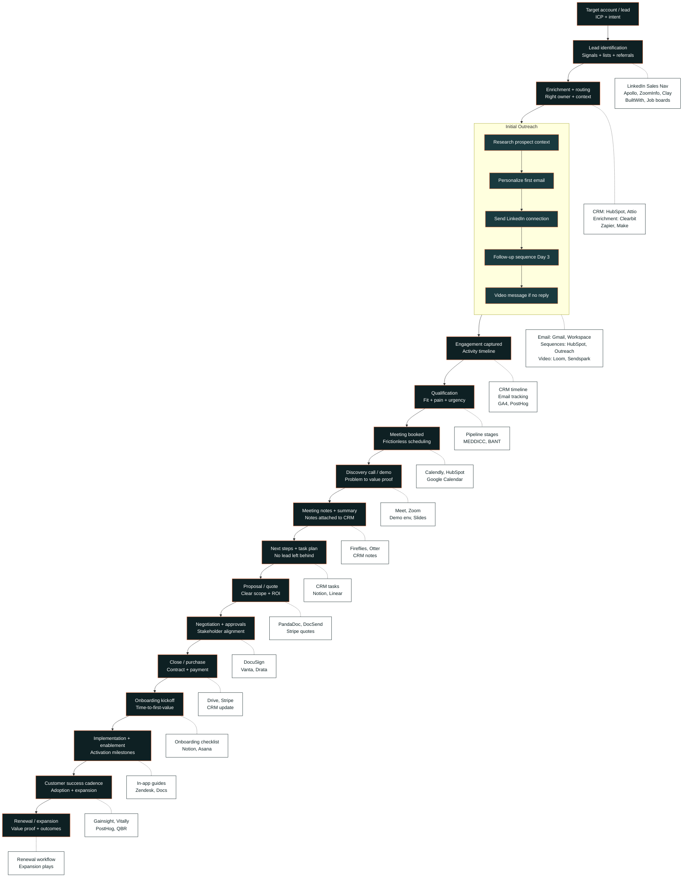

```mermaid
flowchart TB
  A["Target account / lead<br/>ICP + intent"]
  B["Lead identification<br/>Signals + lists + referrals"]
  C["Enrichment + routing<br/>Right owner + context"]
  E["Engagement captured<br/>Activity timeline"]
  F["Qualification<br/>Fit + pain + urgency"]
  G["Meeting booked<br/>Frictionless scheduling"]
  H["Discovery call / demo<br/>Problem to value proof"]
  I["Meeting notes + summary<br/>Notes attached to CRM"]
  J["Next steps + task plan<br/>No lead left behind"]
  K["Proposal / quote<br/>Clear scope + ROI"]
  L["Negotiation + approvals<br/>Stakeholder alignment"]
  M["Close / purchase<br/>Contract + payment"]
  N["Onboarding kickoff<br/>Time-to-first-value"]
  O["Implementation + enablement<br/>Activation milestones"]
  P["Customer success cadence<br/>Adoption + expansion"]
  Q["Renewal / expansion<br/>Value proof + outcomes"]

  A --> B --> C

  subgraph D["Initial Outreach"]
    direction TB
    D1["Research prospect context"]
    D2["Personalize first email"]
    D3["Send LinkedIn connection"]
    D4["Follow-up sequence Day 3"]
    D5["Video message if no reply"]
    D1 --> D2 --> D3 --> D4 --> D5
  end

  C --> D --> E --> F --> G --> H --> I --> J --> K --> L --> M --> N --> O --> P --> Q

  %% Tools
  B -.- B1["LinkedIn Sales Nav<br/>Apollo, ZoomInfo, Clay<br/>BuiltWith, Job boards"]
  C -.- C1["CRM: HubSpot, Attio<br/>Enrichment: Clearbit<br/>Zapier, Make"]
  D -.- DT["Email: Gmail, Workspace<br/>Sequences: HubSpot, Outreach<br/>Video: Loom, Sendspark"]
  E -.- E1["CRM timeline<br/>Email tracking<br/>GA4, PostHog"]
  F -.- F1["Pipeline stages<br/>MEDDICC, BANT"]
  G -.- G1["Calendly, HubSpot<br/>Google Calendar"]
  H -.- H1["Meet, Zoom<br/>Demo env, Slides"]
  I -.- I1["Fireflies, Otter<br/>CRM notes"]
  J -.- J1["CRM tasks<br/>Notion, Linear"]
  K -.- K1["PandaDoc, DocSend<br/>Stripe quotes"]
  L -.- L1["DocuSign<br/>Vanta, Drata"]
  M -.- M1["Drive, Stripe<br/>CRM update"]
  N -.- N1["Onboarding checklist<br/>Notion, Asana"]
  O -.- O1["In-app guides<br/>Zendesk, Docs"]
  P -.- P1["Gainsight, Vitally<br/>PostHog, QBR"]
  Q -.- Q1["Renewal workflow<br/>Expansion plays"]

  classDef stage fill:#0E2023,stroke:#EF6A32,color:#ffffff
  classDef substep fill:#1a3a3f,stroke:#EF6A32,color:#ffffff
  classDef tools fill:#ffffff,stroke:#0E2023,color:#0E2023
  class A,B,C,E,F,G,H,I,J,K,L,M,N,O,P,Q stage
  class D1,D2,D3,D4,D5 substep
  class B1,C1,DT,E1,F1,G1,H1,I1,J1,K1,L1,M1,N1,O1,P1,Q1 tools
```
