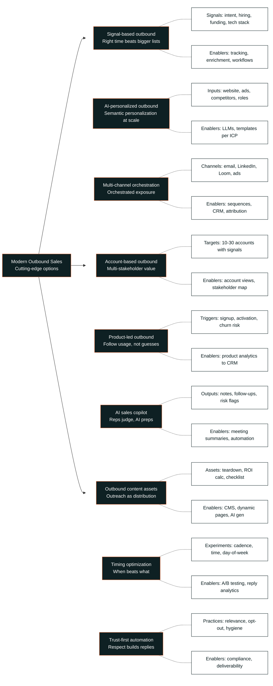

```mermaid
flowchart LR
  A["Modern Outbound Sales<br/>Cutting-edge options"]

  subgraph row1[" "]
    direction LR
    B["Signal-based outbound<br/>Right time beats bigger lists"]
    C["AI-personalized outbound<br/>Semantic personalization at scale"]
    D["Multi-channel orchestration<br/>Orchestrated exposure"]
  end

  subgraph row2[" "]
    direction LR
    E["Account-based outbound<br/>Multi-stakeholder value"]
    F["Product-led outbound<br/>Follow usage, not guesses"]
    G["AI sales copilot<br/>Reps judge, AI preps"]
  end

  subgraph row3[" "]
    direction LR
    H["Outbound content assets<br/>Outreach as distribution"]
    I["Timing optimization<br/>When beats what"]
    J["Trust-first automation<br/>Respect builds replies"]
  end

  A --> row1
  A --> row2
  A --> row3

  %% Details - Signal-based
  B -.- B1["Signals: intent, hiring, funding, tech stack"]
  B -.- B2["Enablers: tracking, enrichment, workflows"]

  %% Details - AI-personalized
  C -.- C1["Inputs: website, ads, competitors, roles"]
  C -.- C2["Enablers: LLMs, templates per ICP"]

  %% Details - Multi-channel
  D -.- D1["Channels: email, LinkedIn, Loom, ads"]
  D -.- D2["Enablers: sequences, CRM, attribution"]

  %% Details - Account-based
  E -.- E1["Targets: 10-30 accounts with signals"]
  E -.- E2["Enablers: account views, stakeholder map"]

  %% Details - Product-led
  F -.- F1["Triggers: signup, activation, churn risk"]
  F -.- F2["Enablers: product analytics to CRM"]

  %% Details - AI copilot
  G -.- G1["Outputs: notes, follow-ups, risk flags"]
  G -.- G2["Enablers: meeting summaries, automation"]

  %% Details - Content assets
  H -.- H1["Assets: teardown, ROI calc, checklist"]
  H -.- H2["Enablers: CMS, dynamic pages, AI gen"]

  %% Details - Timing
  I -.- I1["Experiments: cadence, time, day-of-week"]
  I -.- I2["Enablers: A/B testing, reply analytics"]

  %% Details - Trust-first
  J -.- J1["Practices: relevance, opt-out, hygiene"]
  J -.- J2["Enablers: compliance, deliverability"]

  classDef core fill:#0E2023,stroke:#EF6A32,color:#ffffff
  classDef detail fill:#ffffff,stroke:#0E2023,color:#0E2023
  classDef invisible fill:none,stroke:none
  class A,B,C,D,E,F,G,H,I,J core
  class B1,B2,C1,C2,D1,D2,E1,E2,F1,F2,G1,G2,H1,H2,I1,I2,J1,J2 detail
  class row1,row2,row3 invisible
```
